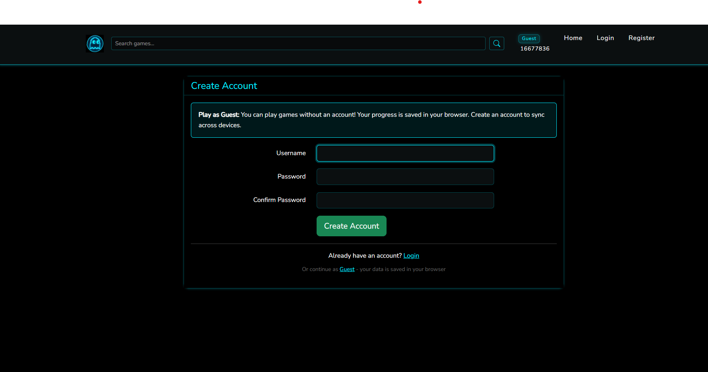
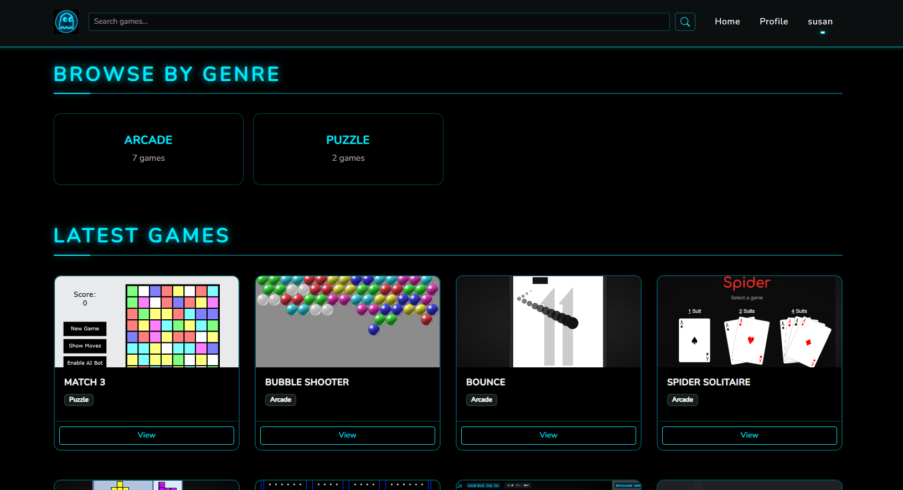
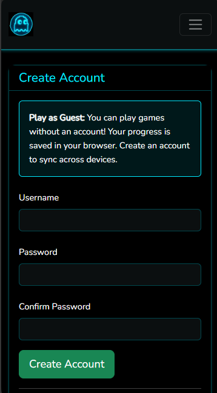
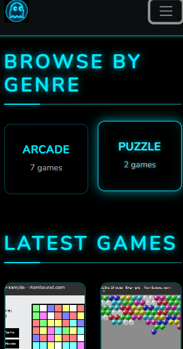

# Abandoned Arcade

A retro game arcade platform built with Laravel.

## About


Abandoned Arcade is a platform for preserving and sharing classic retro games. The system is built with a mobile-first API architecture designed to power native iOS and Android applications, featuring secure authentication, optimized performance, and seamless integration capabilities.

### Platform Previews

#### Desktop Experience



#### Mobile Experience



For detailed information about the API architecture and mobile integration, see [PREVIEW.md](PREVIEW.md). 

## Features

- **RESTful API**: Comprehensive JSON API with 15+ endpoints for mobile app integration
- **Mobile-First Architecture**: Token-based authentication optimized for iOS and Android
- **Game Collection**: Browser with genre filtering, search, and autocomplete
- **Multiple Game Formats**: Support for HTML5, Flash via Ruffle, and embedded games
- **User Management**: Username-based authentication with secure token sessions
- **Game Reviews**: Community-driven reviews and ratings system
- **Save States**: Cloud-based save state management with guest sync
- **Leaderboards**: High score tracking and competitive rankings
- **Guest Mode**: Play without account, sync data when you register
- **Dark Theme**: Neon blue styling with responsive mobile-first design

## Tech Stack

### Backend
- **PHP 8.2** with **Laravel 12** framework
- **RESTful API**: 15+ JSON endpoints for mobile integration
- **Authentication**: Laravel Sanctum (token-based), WorkOS (optional)
- **Database**: Neon PostgreSQL (serverless) with optimized queries
- **Security**: HTTPS-ready, password hashing, CORS support

### Frontend
- **Bootstrap 5** responsive framework
- **Sass/SCSS** for styling
- **Vanilla JavaScript** modules for API integration
- **Vite** for asset bundling

### Mobile Support
- Token-based authentication for native apps
- Guest data synchronization
- Offline-first guest mode
- JSON-only API responses

## Installation

1. Clone the repository
2. Install dependencies:
   ```bash
   composer install
   npm install
   ```
3. Copy `.env.example` to `.env` and configure:
   - Set `DB_CONNECTION=pgsql` for Neon database
   - Configure Neon connection: `DB_HOST`, `DB_DATABASE`, `DB_USERNAME`, `DB_PASSWORD` from your Neon project
   - Set `DB_SSLMODE=require` for secure connection
4. Generate application key:
   ```bash
   php artisan key:generate
   ```
5. Run migrations:
   ```bash
   php artisan migrate
   ```
6. Build assets:
   ```bash
   npm run build
   ```
7. Start development server:
   ```bash
   php artisan serve
   ```

## Game Files

Games are stored in `public/games/` directory. Each game can be:
- A single HTML file
- A folder with multiple files (use `index.html` as entry point)
- Flash games (.swf) played via Ruffle

Add games by placing files in `public/games/` and creating database entries via tinker or seeders.

## API Documentation

The platform provides a comprehensive RESTful API for mobile app integration. See [PREVIEW.md](PREVIEW.md) for detailed API documentation, endpoint reference, and mobile integration guidelines.

### Quick API Test

Use the included PowerShell test script to verify API functionality:

```bash
.\test-api.ps1
```

This will test server connectivity, user registration, authentication, and protected endpoints.

## License

MIT License - See LICENSE file for details
